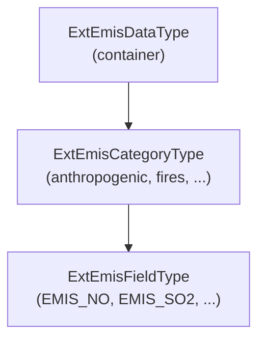

# External Emission Data

External emission data (anthropogenic, biogenic, fires, volcanoes, aircraft,
oxidant fields, and similar inputs read from files) is managed by the core
module `ExtEmisData_Mod` (`src/core/ExtEmisData_Mod.F90`).

This is a **core data structure**, not a process. In the modern CATChem
architecture the **driver performs all file I/O** (opening NetCDF files,
regridding, and time selection) and stores the results in an
`ExtEmisDataType` container. Processes and diagnostics then read from that
container. It is deliberately separate from the `EmisState`, which
accumulates emissions computed at run time.

## Data model

The module defines three nested derived types:



### `ExtEmisFieldType`

A single emission field read from a file, for example `EMIS_NO` or
`EMIS_SO2`. It carries the field metadata (`field_name`, `units`,
dimensions `nx`/`ny`/`nz`, coordinates `lat`/`lon`) and the emission flux
itself in `emission_data(nx, ny, nz, n_times)` [kg/m2/s].

It also supports:

- **Point sources** (stacks, volcanoes) via the `stkdm`/`stkht`/`stktk`/`stkve`
  stack arrays, the `ip`/`jp`/`ijmap` index maps, and per-point `pemis`,
  `pbot`, `ptop`.
- **Time interpolation** across the `n_times` slices in a file
  (`time_interpolate`, `current_time_idx`, `interp_data_t1`/`interp_data_t2`).
- **Vertical remapping** onto the model grid through `emission_data_model`,
  used when a category enables `vertical_interp` so deep source grids are
  pressure-interpolated rather than truncated.

### `ExtEmisCategoryType`

Groups related fields by source category (anthropogenic, biogenic, fires,
etc.) and holds the per-category read/apply settings, including:

- File binding: `source_file`, `format`, `frequency`, `latname`/`lonname`.
- Regridding and time handling: `regrid_method`, `time_interpolation`.
- Vertical treatment: `vertical_dist` (`P100`, `P500`, `Ppbl`, `aviation`),
  `vertical_interp`, `vertical_pressure_mode`, `reverse_vertical`.
- Plume rise and biomass-burning options: `plumerise`, `topfraction`,
  `diurnal_bb`, `use_oc_fbb`.
- Application: `apply_method` (`add` to accumulate or `replace` to overwrite),
  `global_scale`.

### `ExtEmisDataType`

The top-level container holding all categories. It exposes helpers to build
and query the data set: `add_category`, `find_emission_field`,
`get_emission_rate`, `get_column_ptr`, `update_time`, `validate`, and
`get_memory_usage`.

## Typical use

The driver populates the container after reading files, then processes query
it during the run:

```fortran
type(ExtEmisDataType) :: ext_emis
real(fp)              :: rate
real(fp), pointer     :: column(:,:)

! Driver fills ext_emis (categories + fields) after file I/O ...

! Query a single-point rate
rate = ext_emis%get_emission_rate('EMIS_NO', i, j)

! Or grab a (vertical x time) column slice for a field
column => ext_emis%get_column_ptr('anthropogenic', 'EMIS_NO', i, j)
```

The `load_from_file` / `load_emission_files` routines on the field and
container types are placeholders: the actual reading is done by the driver,
which sets `is_loaded` once data is in place.

## Source

- `src/core/ExtEmisData_Mod.F90` — type definitions and procedures.

Full type and procedure listings are available in the auto-generated
[API Reference](../api/index.md).
