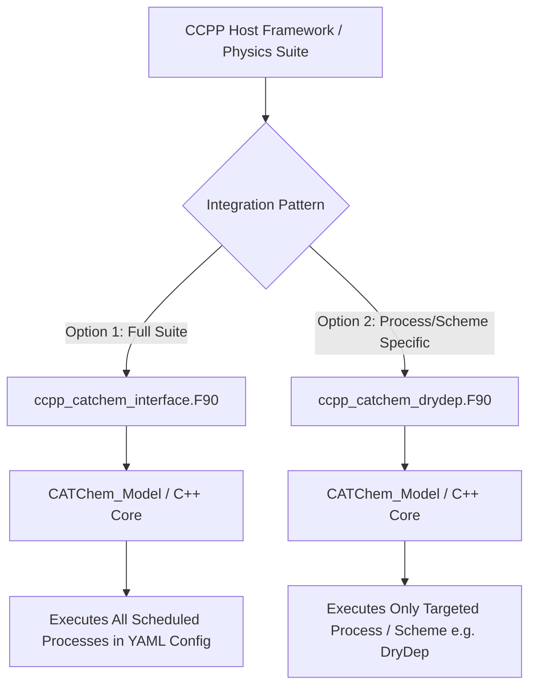

# CCPP Integration Guide

This guide covers integrating CATChem inline with the **Common Community Physics Package (CCPP)** framework used in the Unified Forecast System (UFS) Weather Model.

Inline CCPP integration allows atmospheric chemistry, aerosol physics, photolysis, and surface deposition processes to execute directly within the CCPP physics suite loop (e.g. `suite_FV3_GFS_v16.xml`).

---

## 1. Overview & Integration Options

CATChem provides two distinct CCPP integration patterns depending on host model requirements:



* **Option 1: Full Suite CCPP Driver (`ccpp_catchem_interface.F90`)**: Registers all active chemical tracers dynamically with CCPP and executes all scheduled CATChem processes during a single CCPP suite step.
* **Option 2: Process- or Scheme-Specific CCPP Driver (e.g. `ccpp_catchem_drydep.F90`)**: Integrates a specific CATChem process or science scheme (such as DryDep, Dust, or GasChem) as a targeted CCPP scheme in the physics suite, using CATChem's C++ Core state management and Kokkos acceleration for that specific process.

---

## 2. Option 1: Full CATChem CCPP Driver

The standard driver in `drivers/ccpp/ccpp_catchem_interface.F90` provides full CCPP lifecycle bindings (`register`, `init`, `run`, `finalize`).

### 2.1 Dynamic Constituent Registration (`register`)

During CCPP registration, CATChem loads species metadata from `CATChem_species.yml` via the C++ Core and instantiates dynamic CCPP constituent properties (`ccpp_constituent_properties_t`):

```fortran
subroutine ccpp_catchem_interface_register(constituent_props, errmsg, errflg)
   use ccpp_constituent_prop_mod, only: ccpp_constituent_properties_t
   use CATChem_API,               only: CATChem_Model
   implicit none

   type(ccpp_constituent_properties_t), allocatable, intent(out) :: constituent_props(:)
   character(len=*),                                 intent(out) :: errmsg
   integer,                                          intent(out) :: errflg

   type(CATChem_Model), save :: cc_model
   integer :: n_spec, i
   type(c_ptr) :: state_mgr

   ! Initialize C++ Core to load species metadata
   call cc_model%initialize("./tests/Configs/Default/CATChem_config.yml", 1, 1, 1, rc=errflg)
   state_mgr = cc_model%get_state_manager()
   n_spec = int(catchem_state_get_species_count(state_mgr))

   allocate(constituent_props(n_spec))
   do i = 1, n_spec
      ! Query species attributes from C++ Core
      call catchem_state_get_species_name_at(state_mgr, int(i, c_int), c_buf)
      molar_mass_kg_mol = catchem_state_get_species_mw(state_mgr, int(i, c_int)) * 1.0e-3_kind_phys
      is_gas = (catchem_state_is_species_gas(state_mgr, int(i, c_int)) == 1)

      ! Register with CCPP framework
      call constituent_props(i)%instantiate( &
         std_name      = trim(f_name), &
         units         = 'kg kg-1', &
         vertical_dim  = 'vertical_layer_dimension', &
         molar_mass    = molar_mass_kg_mol, &
         advected      = .true., &
         errcode       = errflg, &
         errmsg        = errmsg )
   end do

   call cc_model%finalize(errflg)
end subroutine ccpp_catchem_interface_register
```

### 2.2 Zero-Copy State Binding (`run`)

During physics execution, the driver extracts active chemical tracers from CCPP, binds 2D/3D meteorological views using zero-copy C pointers (`c_loc`), and calls `cc_model%run_timestep(dt)`:

```fortran
subroutine ccpp_catchem_interface_run(im, kte, kme, ..., constituents, errmsg, errflg)
   ! 1. Extract non-contiguous tracer indices into a local contiguous buffer
   do i = 1, n_spec
      subset_constituents(:,:,i) = constituents(:,:,catchem_indices(i))
   end do

   state_mgr = cc_model%get_state_manager()

   ! 2. Bind 3D/2D meteorological arrays directly to C++ StateManager via c_loc
   call catchem_state_bind_met_3d(state_mgr, "T"//c_null_char, c_loc(tk3d(1,1)))
   call catchem_state_bind_met_3d(state_mgr, "PMID"//c_null_char, c_loc(prl3d(1,1)))
   call catchem_state_bind_met_3d(state_mgr, "PEDGE"//c_null_char, c_loc(pr3d(1,1)))
   call catchem_state_bind_met_2d(state_mgr, "PS"//c_null_char, c_loc(prsfc(1)))
   call catchem_state_bind_met_2d(state_mgr, "USTAR"//c_null_char, c_loc(ustar(1)))
   call catchem_state_bind_unified_chemistry(state_mgr, c_loc(subset_constituents(1,1,1)))

   ! 3. Execute scheduled CATChem processes via C++ Core
   call cc_model%run_timestep(real(dt, fp), errflg)

   ! 4. Synchronize updated tracer fields back to host CCPP array
   do i = 1, n_spec
      constituents(:,:,catchem_indices(i)) = subset_constituents(:,:,i)
   end do
end subroutine ccpp_catchem_interface_run
```

---

## 3. Option 2: How-To Create a Process- or Scheme-Specific CCPP Driver (e.g., `ccpp_catchem_drydep`)

To execute a **specific process or scheme** (such as CATChem DryDep) at a dedicated step in the CCPP physics suite:

### Step 1: Create CCPP Scheme Metadata (`ccpp_catchem_drydep.meta`)

Create `drivers/ccpp/ccpp_catchem_drydep.meta`:

```yaml
[ccpp-table-properties]
  name = ccpp_catchem_drydep
  type = scheme
  dependencies = ../../src/api/CATChem_API.F90

########################################################################
[ccpp-arg-table]
  name = ccpp_catchem_drydep_run
  type = scheme
[im]
  standard_name = horizontal_loop_extent
  units = count
  dimensions = ()
  type = integer
  intent = in
[kte]
  standard_name = vertical_layer_dimension
  units = count
  dimensions = ()
  type = integer
  intent = in
[dt]
  standard_name = timestep_for_physics
  units = s
  dimensions = ()
  type = real
  kind = kind_phys
  intent = in
[ustar]
  standard_name = surface_friction_velocity
  units = m s-1
  dimensions = (horizontal_loop_extent)
  type = real
  kind = kind_phys
  intent = in
[hflux]
  standard_name = surface_upward_sensible_heat_flux
  units = W m-2
  dimensions = (horizontal_loop_extent)
  type = real
  kind = kind_phys
  intent = in
[pblh]
  standard_name = planetary_boundary_layer_height
  units = m
  dimensions = (horizontal_loop_extent)
  type = real
  kind = kind_phys
  intent = in
[z0]
  standard_name = surface_roughness_length
  units = m
  dimensions = (horizontal_loop_extent)
  type = real
  kind = kind_phys
  intent = in
[constituents]
  standard_name = ccpp_constituents
  units = kg kg-1
  dimensions = (horizontal_loop_extent,vertical_layer_dimension,number_of_ccpp_constituents)
  type = real
  kind = kind_phys
  intent = inout
[errmsg]
  standard_name = ccpp_error_message
  units = none
  type = character | kind = len=*
  dimensions = ()
  intent = out
[errflg]
  standard_name = ccpp_error_code
  units = 1
  type = integer
  dimensions = ()
  intent = out
```

### Step 2: Implement the Process-Specific CCPP Subroutine (`ccpp_catchem_drydep.F90`)

Create `drivers/ccpp/ccpp_catchem_drydep.F90`:

```fortran
module ccpp_catchem_drydep
   use iso_c_binding, only: c_loc, c_null_char, c_ptr, c_int, c_char
   use machine,       only: kind_phys
   use CATChem_API,   only: CATChem_Model
   use Error_Mod,     only: CC_SUCCESS
   use precision_mod, only: fp

   implicit none
   private

   public :: ccpp_catchem_drydep_run

   type(CATChem_Model), save :: cc_model_drydep

contains

   subroutine ccpp_catchem_drydep_run(im, kte, dt, ustar, hflux, pblh, z0, &
                                      constituents, errmsg, errflg)
      implicit none

      integer, intent(in) :: im, kte
      real(kind_phys), intent(in) :: dt
      real(kind_phys), dimension(im), intent(in), target :: ustar, hflux, pblh, z0
      real(kind_phys), dimension(:,:,:), intent(inout), target :: constituents

      character(len=*), intent(out) :: errmsg
      integer, intent(out) :: errflg

      type(c_ptr) :: state_mgr

      errmsg = ''
      errflg = 0

      ! 1. Initialize DryDep-specific model instance if not yet initialized
      if (.not. cc_model_drydep%is_initialized()) then
         call cc_model_drydep%initialize("./parm/config/drydep_config.yml", im, 1, kte, rc=errflg)
         if (errflg /= CC_SUCCESS) then
            errmsg = 'DryDep CCPP Run: Failed to initialize CATChem Core for DryDep.'
            return
         end if
      end if

      state_mgr = cc_model_drydep%get_state_manager()

      ! 2. Bind required surface & boundary layer met fields using c_loc
      call catchem_state_bind_met_2d(state_mgr, "USTAR"//c_null_char, c_loc(ustar(1)))
      call catchem_state_bind_met_2d(state_mgr, "HFLUX"//c_null_char, c_loc(hflux(1)))
      call catchem_state_bind_met_2d(state_mgr, "PBLH"//c_null_char, c_loc(pblh(1)))
      call catchem_state_bind_met_2d(state_mgr, "Z0H"//c_null_char, c_loc(z0(1)))
      call catchem_state_bind_unified_chemistry(state_mgr, c_loc(constituents(1,1,1)))

      ! 3. Run timestep - executes only the configured DryDep process
      call cc_model_drydep%run_timestep(real(dt, fp), errflg)
      if (errflg /= CC_SUCCESS) then
         errmsg = 'DryDep CCPP Run: Execution failed inside CATChem Core.'
         return
      end if

   end subroutine ccpp_catchem_drydep_run

end module ccpp_catchem_drydep
```

### Step 3: Configure Process Selection (`drydep_config.yml`)

Configure `./parm/config/drydep_config.yml` to specify the active process and desired scheme algorithms (e.g. Wesely gas deposition + GOCART aerosol deposition):

```yaml
# CATChem Process Configuration for Standalone CCPP DryDep
model:
  name: "CATChem CCPP DryDep"

grid:
  nx: 100
  ny: 1
  nz: 64

process:
  drydep:
    gas_scheme: "wesely"
    aero_scheme: "gocart"
    diagnostics: true
```

### Step 4: Add Scheme to CCPP Suite Definition XML (`suite_FV3_GFS_v16.xml`)

Add the process-specific scheme to your host model physics suite XML:

```xml
<suite name="FV3_GFS_v16" version="1">
  <group name="surface_physics">
    <subcycle loop="1">
      <scheme>sfc_diff</scheme>
      <scheme>sfc_drv</scheme>
      <!-- Execute CATChem DryDep right after surface driver -->
      <scheme>ccpp_catchem_drydep</scheme>
    </subcycle>
  </group>
</suite>
```

---

## 4. Best Practices for CCPP Integration

1. **Zero-Copy Binding**: Always use `c_loc` and C-API pointer bindings (`catchem_state_bind_met_2d/3d`) to connect host arrays directly to `catchem::StateManager`.
2. **Explicit Error Handling**: Always set `errmsg` and `errflg` (0 for success, non-zero for error) on CCPP boundary subroutines.
3. **Linker Safety**: Ensure all process static libraries are properly linked in CMake so creator lambdas in `catchem::ProcessRegistry` are available at runtime.

---

## See Also

* [Process Interface API](../api/process-interface.md) - C++ process execution lifecycle
* [Configuration API](../api/configuration.md) - YAML configuration file specs
* [NUOPC Integration Guide](nuopc.md) - ESMF/NUOPC cap integration
