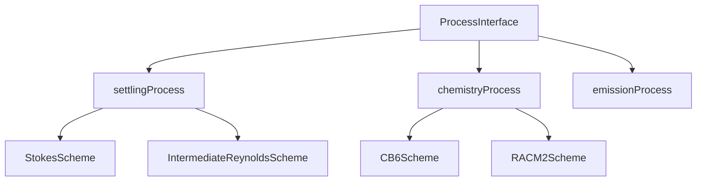

# Process Architecture

CATChem uses a modern, extensible process architecture that enables easy development and integration of atmospheric physics and chemistry processes.

## Overview

The process architecture is built around three key concepts:

1. **ProcessInterface**: Abstract base class defining the standard interface
2. **Process Modules**: Concrete implementations of specific atmospheric processes
3. **Scheme Modules**: Interchangeable algorithmic implementations within processes



## ProcessInterface Base Class

All processes extend the abstract C++ `catchem::ProcessInterface` class defined in `src/core/catchem_process_interface.hpp`:

```cpp
namespace catchem {

    class ProcessInterface {
    public:
        virtual ~ProcessInterface() = default;

        virtual std::string get_name() const = 0;
        virtual void init(std::shared_ptr<StateManager> state) = 0;
        virtual void run(std::shared_ptr<StateManager> state) = 0;
        virtual void finalize() = 0;
    };

} // namespace catchem
```

### Required Methods

Every process must implement three core C++ methods:

#### `init(state)`
- Initialize the process with C++ `StateManager`
- Set up diagnostic fields in `DiagnosticManager`
- Prepare dynamic species mapping and index lists

#### `run(state)`
- Sync C++ Kokkos state host views
- Retrieve meteorological and chemical pointers from `StateManager`
- Invoke the Fortran `ScienceBridge` via `extern "C"`
- Accumulate tendencies and update device views

#### `finalize()`
- Clean up allocated resources and state handles

## Process Development Workflow

### 1. Create Process Structure

```bash
# Create process directory
mkdir src/process/myprocess
mkdir src/process/myprocess/schemes

# Create required files
touch src/process/myprocess/catchem_process_myprocess.hpp
touch src/process/myprocess/catchem_process_myprocess.cpp
touch src/process/myprocess/MyProcessScienceBridge.F90
touch src/process/myprocess/MyProcessCommon_Mod.F90
touch src/process/myprocess/CMakeLists.txt
touch src/process/myprocess/schemes/CMakeLists.txt
```

### 2. Implement Process Science Bridge

```fortran
module MyProcessScienceBridge_Mod
   use iso_c_binding
   use precision_mod, only: fp
   use StateManager_Mod, only: StateManagerType
   use Error_Mod, only: CC_SUCCESS

   implicit none
   private

   public :: run_myprocess_science_bridge

contains

   subroutine run_myprocess_science_bridge( &
      n_cols, n_levels, n_species, dt, &
      conc, tendency, rc) bind(C, name="run_myprocess_science_bridge")

      integer(c_int), value :: n_cols, n_levels, n_species
      real(c_double), value :: dt
      type(c_ptr), value :: conc, tendency
      integer(c_int), intent(out) :: rc

      real(c_double), pointer :: f_conc(:,:,:), f_tendency(:,:,:)

      if (c_associated(conc)) call c_f_pointer(conc, f_conc, [n_cols, n_levels, n_species])
      if (c_associated(tendency)) call c_f_pointer(tendency, f_tendency, [n_cols, n_levels, n_species])

      ! Execute process logic
      rc = CC_SUCCESS
   end subroutine run_myprocess_science_bridge

end module MyProcessScienceBridge_Mod
```

### 3. Implement Pure Science Schemes

Schemes provide interchangeable algorithms within a process:

```fortran
module MyScheme_Mod
   use precision_mod, only: fp
   use Error_Mod, only: CC_SUCCESS

   implicit none
   private

   public :: myscheme_calculate

contains

   subroutine myscheme_calculate(n_levels, n_species, dt, conc, tendency, rc)
      integer, intent(in) :: n_levels, n_species
      real(fp), intent(in) :: dt
      real(fp), intent(in) :: conc(n_levels, n_species)
      real(fp), intent(out) :: tendency(n_levels, n_species)
      integer, intent(out) :: rc

      ! Scheme-specific calculations
      rc = CC_SUCCESS
   end subroutine myscheme_calculate

end module MyScheme_Mod
```

## State Manager Integration

Processes interact with model state through `catchem::StateManager` (C++) or `StateManagerType` (Fortran):

### Accessing State Data

```fortran
! Get meteorological state
type(MetStateType), pointer :: met_state
met_state => state_mgr%get_met_state_ptr()

! Access temperature, pressure, etc.
real(fp), pointer :: temperature(:,:,:)
temperature => met_state%get_field('temperature')

! Get chemical state
type(ChemStateType), pointer :: chem_state
chem_state => container%get_chem_state_ptr()

! Access species concentrations
real(fp), pointer :: o3_conc(:,:,:)
o3_conc => chem_state%get_species_ptr('O3')
```

### Error Handling

```fortran
type(ErrorManagerType), pointer :: error_mgr
error_mgr => container%get_error_manager()

! Report errors
call error_mgr%report_error("Process calculation failed")

! Report warnings
call error_mgr%report_warning("Using default parameter value")

! Report informational messages
call error_mgr%report_info("Process completed successfully")
```

### Diagnostics

```fortran
type(DiagnosticManagerType), pointer :: diag_mgr
diag_mgr => state_mgr%get_diagnostic_manager()

! Register diagnostic variables
call diag_mgr%register_field('settling_velocity', &
                            'Particle settling velocity', &
                            'm/s', shape(settling_vel))

! Update diagnostic values
call diag_mgr%update_field('settling_velocity', settling_vel)
```

## Column Virtualization

CATChem processes operate on 1D columns for optimal performance via zero-copy Kokkos subviews (C++) or 1D array section slicing (Fortran):

```cpp
// Kokkos subview slicing 1D column from 3D state
auto col_temp = Kokkos::subview(state->met.T->view(), icol, Kokkos::ALL(), 0);
for (int k = 0; k < state->n_levels; ++k) {
    col_temp(k) = calculate_level_temperature(col_temp(k));
}
```

```fortran
! Fortran column processing inside ScienceBridge
do icol = 1, n_cols
   call compute_scheme(n_levels, n_species, dt, f_conc(icol, :, :), f_tendency(icol, :, :))
end do
```

## Configuration Integration

Processes are configured through YAML files:

```yaml
processes:
  - name: myprocess
    enabled: true
    scheme: MyScheme
    timestep: 60.0
    parameters:
      process_parameter: 2.5
      enable_diagnostics: true
    diagnostics:
      - name: process_rate
        output_frequency: hourly
      - name: process_flux
        output_frequency: daily
```

## Testing and Validation

### Unit Testing

Create unit tests for individual process components:

```fortran
program test_myprocess_science
   use MyProcessScienceBridge_Mod
   use testing_mod

   ! Test calculation
   call run_myprocess_science_bridge(...)
   call assert(.true., "Process science bridge execution passed")
   call assert_equal(rc, CC_SUCCESS, "Process run failed")

   ! Verify results
   ! ... test assertions ...

end program test_myprocess
```

### Integration Testing

Test process integration with the full model:

```fortran
! Create test configuration
call create_test_state_container(container)

! Initialize and run process
call process%init(container, rc)
call process%run(container, rc)

! Validate conservation laws
call validate_mass_conservation(container)
call validate_energy_conservation(container)
```

## Performance Considerations

### Memory Management

- Use pointer associations for large arrays
- Avoid unnecessary allocations in run() method
- Clean up temporary arrays in finalize()

### Computational Efficiency

- Vectorize inner loops where possible
- Minimize conditional branches in tight loops
- Use compiler optimization flags

### Parallel Scalability

- Design for column-parallel execution
- Avoid global reductions where possible
- Use thread-safe operations only

## Best Practices

1. **Keep processes focused**: Each process should handle one physical phenomenon
2. **Use descriptive names**: Process and variable names should be self-documenting
3. **Validate inputs**: Always check state data consistency in init()
4. **Handle errors gracefully**: Use the error manager for all error reporting
5. **Document thoroughly**: Include Doxygen comments for all public interfaces
6. **Test extensively**: Write unit tests for all major functionality
7. **Follow naming conventions**: Use consistent naming patterns across processes

## Example: Settling Process

The settling process demonstrates best practices:

- **Clear interface**: Extends ProcessInterface with required methods
- **Multiple schemes**: Supports Stokes and intermediate Reynolds number schemes
- **Comprehensive diagnostics**: Outputs settling velocity and particle flux
- **Error handling**: Validates inputs and reports meaningful errors
- **Column processing**: Optimized for 1D column calculations

See the [Creating New Processes](creating.md) guide for step-by-step instructions on developing your own process modules.
